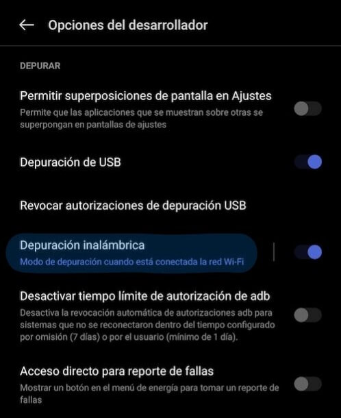

# ADB Quick Connect (adb-qc)

[](https://www.npmjs.com/package/adb-qc)
[](https://img.shields.io/npm/dt/adb-qc.svg)
[](https://www.npmjs.com/package/adb-qc)


**ADB Quick Connect (adb-qc)** es una herramienta que simplifica la conexión y emparejamiento de dispositivos Android con ADB (Android Debug Bridge) a través de Wi-Fi. Permite realizar emparejamientos utilizando códigos QR o códigos de emparejamiento, y también conectar a dispositivos disponibles en la red.

## Características

-  **Emparejamiento con Código QR**: Facilita el emparejamiento de dispositivos utilizando códigos QR.

-  **Emparejamiento con Código de Emparejamiento**: Permite emparejar dispositivos utilizando un código de emparejamiento.

-  **Conexión a Dispositivos**: Conecta a dispositivos disponibles en la red.

## Instalación

<table>
<tr>
  <th>npm</th>
  <th>yarn</th>
</tr>
<tr>
<td>

```sh
npm install -g adb-qc
```

</td>
<td>

```sh
yarn global add adb-qc
```

</td>
</tr>
</table>

## Uso

Una vez instalado globalmente, puedes ejecutar la herramienta desde la línea de comandos con diferentes opciones:

### Opciones de Línea de Comandos

-  `--qr` o `-q`: Muestra un código QR para el emparejamiento.

-  `--pair` o `-p`: Empareja un dispositivo utilizando un código de emparejamiento.

-  `--connect` o `-c`: Conecta a un dispositivo disponible en la red.

### Ejemplos

1.  **Mostrar Código QR para Emparejamiento**:

Ejecuta el comando `adb-qc --qr` para mostrar un código QR.


2.  **Emparejar Dispositivo con Código de Emparejamiento**:

Ejecuta el comando `adb-qc --pair` para emparejar un dispositivo utilizando un código de emparejamiento.


1.  **Conectar a un Dispositivo**:

Ejecuta el comando `adb-qc --connect` para conectar a un dispositivo disponible en la red.


1.  **Si no se proporcionan parámetros**, se te pedirá que selecciones una acción a través de un menú interactivo.


## Cómo Habilitar la Depuración Inalámbrica

Para utilizar **ADB Quick Connect**, necesitas habilitar la depuración inalámbrica en tu dispositivo Android. Sigue estos pasos:

1. **Habilitar las Opciones de Desarrollador**:
   - Ve a **Configuración** en tu dispositivo Android.
   - Desplázate hacia abajo y selecciona **Acerca del teléfono**.
   - Busca el **Número de compilación** y tócalo siete veces. Verás un mensaje indicando que ahora eres un desarrollador.

2. **Activar la Depuración Inalámbrica**:
   - Regresa a **Configuración** y selecciona **Sistema**.
   - Toca **Avanzado** y luego **Opciones de desarrollador**.
   - Activa **Depuración inalámbrica** (puede que esté en una sección diferente dependiendo del fabricante).

3. **Conectar a la Red Wi-Fi**:
   - Asegúrate de que tu dispositivo esté conectado a la misma red Wi-Fi que tu computadora.

   

4. **Emparejar el Dispositivo**:
   - Usa **ADB Quick Connect** para mostrar un código QR o ingresar un código de emparejamiento.

   

## Cómo Funciona

1.  **Generación de Identificadores**: La herramienta genera un nombre único y una contraseña para el emparejamiento.

2.  **Descubrimiento de Dispositivos**: Utiliza `mDNS` para descubrir dispositivos disponibles para emparejamiento o conexión.

3.  **Emparejamiento con QR o Código**: Dependiendo de la opción seleccionada, muestra un código QR o solicita un código de emparejamiento.

4.  **Conexión**: Permite conectar a dispositivos disponibles en la red.

## Contribuciones

¡Las contribuciones son bienvenidas! Si tienes ideas para mejoras o encuentras errores, no dudes en abrir un **issue** o enviar un **pull request**.

# License

ADB Quick Connect is licensed under the [MIT license](https://github.com/AngelKrak/adb-qc/blob/main/LICENSE) © [Angel Ramirez](https://github.com/AngelKrak/)

